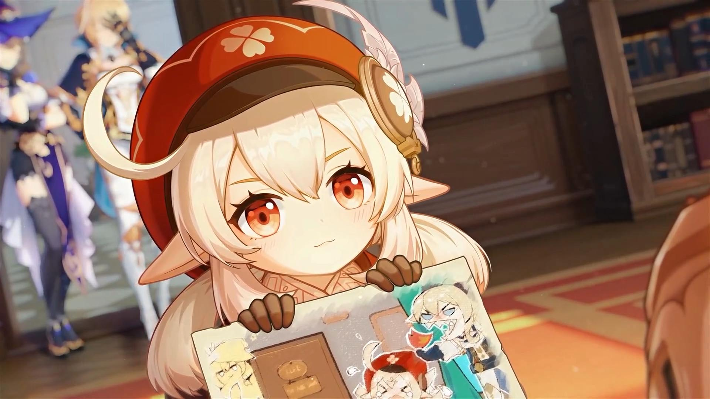

<h1 style="text-align:center">
可莉语音包 

</h1>

> 程序员哥哥，你是来找可莉玩的吗？

可莉语音包，适用于 [vscode-rainbow-fart](https://github.com/SaekiRaku/vscode-rainbow-fart) 拓展。

## 支持计算机语言

- C#
- PHP
- JavaScript
- 欢迎添加

## 适用于使用版本

[Release](https://github.com/Ran-ying/Klee-rainbow-fart/releases)

## 关于语音包

本语音包在 [可莉语音 - 原神WIKI_BWIKI_哔哩哔哩](https://wiki.biligame.com/ys/%E5%8F%AF%E8%8E%89%E8%AF%AD%E9%9F%B3) 获取，原型是 [原神](https://ys.mihoyo.com/) 游戏中的 [火花骑士·可莉](https://zh.moegirl.org.cn/index.php?title=%E5%8F%AF%E8%8E%89)，由 CV [花玲](https://space.bilibili.com/7966) 配音。

此处列举了 voices 目录下文件的内容：

|文件名称|语音名称|语音内容|
|--------------------------------|------------|--------------------------------------------------------------------------------------|
| first-meet.ogg                 | 初次见面···    | 西风骑士团，「火花骑士」，可莉，前来报到！…呃——后面该说什么词来着？可莉背不下来啦...                                        |
| good-morning.ogg               | 早上好···     | 早安！带可莉出去玩吧！我们一起来冒险！                                                                  |
| good-noon.ogg                  | 中午好···     | 午饭时间到了！啊...吃什么呢？我来看看《提瓦特游览指南》...                                                     |
| good-evening.ogg               | 晚上好···     | 晚上好！拜托你也帮我跟霍夫曼先生说说吧，可莉不是小孩子了，可莉晚上也可以出去玩——带我出去玩——                                     |
| good-night.ogg                 | 晚安···      | 虽然出来玩的时候说不想回家，但天黑以后的旷野，不认识路…拜、拜托你回去的时候，把我也送回家好不好…                                    |
| chatting-harvest.ogg           | 闲聊·收获      | 可莉今天又勇敢地抓到了花纹奇怪的蜥蜴！从没见过这种图案，你要看看吗？                                                   |
| chatting-adventure.ogg         | 闲聊·冒险      | 要和可莉一起去炸鱼吗？虽然被抓住就是一整天的禁闭，但鱼很好吃，所以值得！                                                 |
| chatting-law.ogg               | 闲聊·守则      | 「城里放炮禁闭室报到」、「炸弹伤人琴找上门」、「放火烧山可莉完蛋」——这就是可莉在骑士团的生存守则。                                   |
| raining.ogg                    | 下雨的时候···   | 哼哼哼，这次的炸弹可是防水的。                                                                      |
| thundering.ogg                 | 打雷的时候···   | 啊！什么东西爆炸了？！…哦，是打雷啊。                                                                  |
| winding.ogg                    | 刮大风了···    | 风神保佑，把可莉的炸弹往合适的地方吹吧。                                                                 |
| about-herself-compensation.ogg | 关于可莉自己·赔偿  | 我，我还挺会做手工的，请让我帮你们重新做一个…什么？禁止雇佣童工？呜…                                                  |
| about-us-knight.ogg            | 关于我们·骑士    | 呼呼…荣誉骑士，可莉作为「火花骑士」可以说是你在西风骑士团的前辈喔？所以！所以…这次我闯的祸，能不能帮我隐瞒一下….                           |
| about-us-playmate.ogg          | 关于我们·玩伴    | 不行！才九点，可莉今晚一定要撑到看完马戏团的午夜专场！你是可莉的玩伴吧！那就别想现在就把我送回家，略略略略…                               |
| about-eye-of-god.ogg           | 关于「神之眼」··· | 这个小小的玻璃球，就代表了巴巴托斯大人对可莉的肯定吗…唔…究竟是认可了我的哪一部分呢？是自由吗？那以后要不要更自由地出去炸鱼，来回应巴巴托斯大人的期待呢.？       |
| share.ogg                      | 有什么想要分享··· | 可莉知道，骑士团的墙是不能炸的。虽然打通了能从禁闭室出去很方便，但凯亚哥哥说，这样做了以后，琴团长恐怕会让我再也见不到第二天的太阳…                   |
| interesting.ogg                | 感兴趣的见闻···  | 每一只蜥蜴的花纹都是不同的，有些蜥蜴的尾巴干燥以后磨成粉，可以当做炸药的材料哦。这是阿贝多哥哥告诉我的事。                                |
| about-reze.ogg                 | 关于雷泽···    | 我们是朋友！雷泽努力对抗危机、保护可莉的样子，让人安心。唔…虽然基本上都是我把危机带到他身边的...                                   |
| about-parents.ogg              | 关于父母···    | 爸爸和妈妈都是全大陆有名的旅行家！妈妈写的《提瓦特游览指南》，有好多餐馆和旅店都很在意它的权威评价呢。                                  |
| about-kea.ogg                  | 关于凯亚···    | 凯亚哥哥是好人！《骑团生存守则》就是凯亚哥哥帮可莉写的。可莉闯祸的时候，他也经常帮忙遮掩呢。                                       |
| about-amber.ogg                | 关于安伯···    | 安柏姐姐是好人！兔兔伯爵摸起来也是毛茸茸的，而且还会爆炸，太棒了！                                                    |
| about-jean.ogg                 | 关于琴···     | 琴团长是好人！虽然…有点可怕...                                                                    |
| about-diluc.ogg                | 关于迪卢克···   | 奇怪的大人，一直都是不太开心的样子。唔…为什么不喜欢笑呢？                                                        |
| about-lisa.ogg                 | 关于丽莎···    | 丽莎阿…丽莎姐姐是好人！每次可莉靠近她的工坊，她就会给可莉好吃的茶点…欸？说起来我想进她的工坊，好像一开始是想做新的炸药来着…？                     |
| about-bennett.ogg              | 关于班尼特···   | 班尼特哥哥是好人！和他一起冒险，可莉总能有更多收获！…虽然班尼特哥哥自己总是什么宝物都找不到，嗯…这是为什么呢？                             |
| about-diona.ogg                | 关于迪奥娜···   | 迪奥娜姐姐是好人！「靠一己之力摧毁蒙德酒业」的想法好有趣，可莉也要用炸弹来帮忙！——呃，虽然不太懂什么叫做「蒙德酒业」，是怪物吗？                    |
| about-abedo.ogg                | 关于阿贝多···   | 阿贝多哥哥跟可莉有个秘密的约定！要是可莉看到工坊门前挂着「实验进行中」的牌子，就要晚点再去找他。阿贝多哥哥不工作的时候，会很耐心地陪着可莉，所以可莉也会很耐心地等着的！ |
| about-mona.ogg                 | 关于莫娜···    | 莫娜姐姐是好人！她每次找阿贝多哥哥和可莉玩的时候，都会说好多听不明白但是很有趣的东西！可莉喜欢她来玩！                                  |
| about-sugar.ogg                | 关于砂糖···    | 砂糖姐姐是好人！她问我，想不想要一个会跑会跳的蹦蹦！嘿嘿嘿，当然想要了，我还想要好几百个，让蒙德的街道上，台阶上，广场上，全是蹦蹦！                   |
| toknow-1.ogg                   | 想要了解可莉·其一  | 你好！你是来找可莉玩的吗？                                                                        |
| toknow-2.ogg                   | 想要了解可莉·其二  | 是啊，这个炸弹是可莉最新改良的作品！你看我做得好不好？…呃——如果是在什么纵火现场发现的话，那就不是我做的，绝对不是。                          |
| toknow-3.ogg                   | 想要了解可莉·其三  | 哎，虽然新炸药的配方，很多都是在被关禁闭的时候想出来的…但如果不被关禁闭的话就更好了...                                        |
| toknow-4.ogg                   | 想要了解可莉·其四  | 这是嘟嘟可，是可莉很久以前就交到的好朋友。要记得它的名字哦，以后别叫它「挂在你包上的玩偶」啦。                                      |
| toknow-5.ogg                   | 想要了解可莉·其五  | 谢谢你总是帮可莉解决麻烦！就用这串「可莉烤鱼」来报答你吧！——呃，其实鱼是直接在湖里就被炸弹烤熟了，不过这件事就和平时一样，假装不知道好了。               |
| likes.ogg                      | 可莉的爱好···   | 可莉喜欢毛茸茸的东西。比如嘟嘟可、蒲公英，还有雷泽的头发。                                                        |
| troubles.ogg                   | 可莉的烦恼···   | 唉，你是好人，我是坏孩子…等我这次的禁闭结束、好好反省过以后，再来找你带我出去玩...                                          |
| like-food.ogg                  | 喜欢的食物···   | 蒙德的鲈鱼是很好吃的，从果酒湖里抓到的尤其好吃！这可不是瞎说的，连妈妈也认同可莉的想法喔。                                        |
| hate-food.ogg                  | 讨厌的食物···   | 讨厌蒙德蟹——什么蟹都讨厌——可莉要出去玩——不要坐在餐桌前慢慢剥壳——                                                 |
| breakthrough-1.ogg             | 突破的感受·起    | 嗯，新型炸弹研究完毕！趁琴团长发现之前，开溜！                                                              |
| breakthrough-2.ogg             | 突破的感受·承    | 又进步了一点！不过琴团长总是说：「进步是分内之事。」                                                           |
| breakthrough-3.ogg             | 突破的感受·转    | 谢谢你总是陪我一起收集研究用的材料！如果你想学习炸弹的制作方法，我也可以来教你哦。                                            |
|                                | 突破的感受·合    | 很久以前，第一听到爆炸声的时候，我没有害怕…后来我才知道，大部分人不是这样的…不过，你也不害怕我的炸弹呢！嘿嘿，太好了，可莉果然交到了很好的朋友！            |
| dadada.ogg                     | 冲刺_哒哒哒     | 哒哒哒                                                                                  |
| lalala.ogg                     | 冲刺_啦啦啦     | 啦啦啦                                                                                  |
